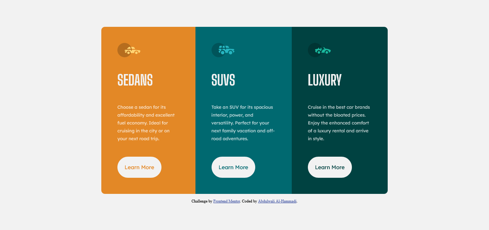

# Frontend Mentor - 3-column preview card component solution

This is a solution to the [3-column preview card component challenge on Frontend Mentor](https://www.frontendmentor.io/challenges/3column-preview-card-component-pH92eAR2-). Frontend Mentor challenges help you improve your coding skills by building realistic projects. 

## Table of contents

- [Overview](#overview)
  - [The challenge](#the-challenge)
  - [Screenshot](#screenshot)
  - [Links](#links)
- [My process](#my-process)
  - [Built with](#built-with)
  - [What I learned](#what-i-learned)
  - [Useful resources](#useful-resources)
- [Acknowledgments](#acknowledgments)

## Overview

This web-based 3 Column Preview Card Component was created as a challenge from Frontend Mentor, aiming to replicate a provided design and ensure its responsiveness on different devices.

### The challenge

Users should be able to:

- View the optimal layout for the interface depending on their device's screen size
- See hover and focus states the button element on the page

### Screenshot

#### Desktop Preview

#### Mobile Preview

### Links

- Solution URL: [https://github.com/AbdulwaliAlhammadi/huddle-landing-page-with-single-introductory-section-master.git](https://github.com/AbdulwaliAlhammadi/huddle-landing-page-with-single-introductory-section-master.git)
- Live Site URL: [https://abdulwalialhammadi.github.io/huddle-landing-page-with-single-introductory-section-master/index.html](https://abdulwalialhammadi.github.io/huddle-landing-page-with-single-introductory-section-master/index.html)

## My process

### Built with

- HTML: Structure and content creation.
- CSS: Styling and layout.
- Google Fonts: Both "Lexend Deca" and "Big Shoulders Display" font for typography.

### What I learned

- Deepened understanding of responsive design principles.
- Efficient theming with CSS custom properties.
- Improved troubleshooting skills for layout and alignment.
- Pseudo-classes and pseudo-elements

### Useful resources
- MDN website:[https://developer.mozilla.org/en-US/docs/Learn/CSS/Building_blocks/Selectors/Pseudo-classes_and_pseudo-elements](https://developer.mozilla.org/en-US/docs/Learn/CSS/Building_blocks/Selectors/Pseudo-classes_and_pseudo-elements)

## Acknowledgments

- Frontend Mentor for the challenging project.
- The online development community for valuable resources and support.

